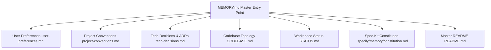

# 🧠 Project4 Master Brain & Memory Vault Index

> **SINGLE MASTER ENTRY POINT FOR ALL AI AGENTS & DEVELOPERS**
> 
> *Reading this file provides complete, 360-degree context on workspace rules, user preferences, architecture topology, audited dependencies, active status, commands, and documentation portals across sessions.*

---

## 📌 Master Navigation Map



---

## 1. 🗣️ User Preferences & Communication Directives
* **[Read Full User Preferences (`user-preferences.md`)](user-preferences.md)**
* **Terminal Communication**: Respond strictly in English markdown (no Arabic characters in terminal outputs to prevent encoding corruption).
* **Package Manager Standard**: Mandatory `pnpm` execution (`pnpm run`, `pnpm exec`, `pnpm install`, `pnpm info`). `npm` CLI commands are strictly forbidden.
* **Directive 6 - Always-Latest Package Protocol**: Always query live registries (`pnpm info <pkg> version`, `context7` live docs) before adopting or upgrading dependencies.
* **Framework Guidelines**:
  - **Next.js v16.3.0+**: Network boundary at `src/proxy.ts` (export `proxy()`), explicit `use cache` directive with `cacheComponents: true` in `next.config.ts`, React 19 Compiler auto-memoization, `use()` hook for server promises.
  - **Supabase CLI v2.114.0+**: `@supabase/ssr` cookie auth handling, B-tree indexed RLS policies (`auth.uid() = user_id`).
  - **Drizzle ORM v0.45.2+**: Version-controlled SQL migrations in `supabase/migrations/`.
  - **TypeScript v5.7+**: Zero-crash strict flags (`"strict": true`, `"noUncheckedIndexedAccess": true`, `"exactOptionalPropertyTypes": true`).
  - **OpenTelemetry v1.34**: Structured JSON logging with W3C `traceparent` context propagation (`src/infrastructure/telemetry/tracer.ts`).

---

## 2. 🏛️ System Architecture & Conventions
* **[Read Project Conventions (`project-conventions.md`)](project-conventions.md)**
* **[Read Codebase Architecture Topology (`CODEBASE.md`)](../../CODEBASE.md)**
* **Git Branching Topology**: Protected `main` trunk, primary `develop` integration branch, short-lived `feature/*` SDD branches.
* **4-Tier Clean Architecture**:
  - `src/domain/`: Pure business entities & repository contracts (zero framework dependencies).
  - `src/application/`: Application use cases, DTOs, and orchestration services.
  - `src/infrastructure/`: Database adapters (Drizzle ORM), OpenTelemetry tracer, API clients.
  - `src/features/` & `src/app/`: Next.js 16 App Router UI routes and layouts.
* **Monorepo Backbone**: Shared internal packages (`packages/types`, `packages/config`, `packages/utils`) with `@project4/*` path aliases.

---

## 3. 📜 Technical Decisions & ADRs (ADRs 1–11)
* **[Read All Architecture Decision Records (`tech-decisions.md`)](tech-decisions.md)**
* **ADR 1**: Client-side secret scanning via `.githooks/pre-commit` (Gitleaks).
* **ADR 2**: Git Conflict Memory (`rerere`).
* **ADR 3**: Machine audit metadata via `git notes --ref=ai-audit`.
* **ADR 4**: Subsecond linters & formatters via Biome (`@biomejs/biome@2.5.8`).
* **ADR 5**: Enterprise 1-Click DevContainer (`.devcontainer/devcontainer.json`).
* **ADR 6**: Strict Zero-Crash TypeScript 5.7+ compiler flags (`tsconfig.json`).
* **ADR 7**: OpenTelemetry v1.34 structured tracing (`src/infrastructure/telemetry/tracer.ts`).
* **ADR 8**: CycloneDX v1.6 SBOM supply-chain inventory (`make sbom` -> `sbom.cdx.json`).
* **ADR 9**: Monorepo package backbone (`@project4/types`, `@project4/config`, `@project4/utils`).
* **ADR 10**: Cryptographic Live File Manifest (`make manifest` -> `docs/manifest/LIVE_FILE_MANIFEST.md`).
* **ADR 11**: AG Kit Health Diagnosis Contract readiness (`make doctor` 6/6 PASS) & `MIGRATION.md`.

---

## 4. 📊 Active Workspace Status & Health
* **[Read Live Workspace Status Board (`STATUS.md`)](../../STATUS.md)**
* **Environment Health**: 100% PASS on `make check` (manifest + sbom + lint + format + typecheck + security) and `make doctor`.
* **Active Integration Branch**: `develop` (Clean, fully synced with 2026 enterprise standards).

---

## 5. 📜 Spec-Driven Development (SDD) & Spec-Kit
* **[Read Ratified Project Constitution](../../.specify/memory/constitution.md)**
* **[Read Latest Upgrade Plan](../../docs/superpowers/plans/2026-08-13-ultimate-2026-env-upgrade.md)**
* **SDD 5-Phase Workflow**: `/speckit.specify` -> `/speckit.plan` -> `/speckit.tasks` -> `/speckit.implement` -> `/speckit.checklist`.

---

## ⚡ 6. Master CLI Quick-Reference

| Command | Purpose |
| :--- | :--- |
| **`make check`** | Run full 7-stage pre-flight audit (manifest + sbom + lint + format + typecheck + security). |
| **`make test`** | Run automated unit and integration test suite. |
| **`make manifest`** | Generate timestamped cryptographic file manifest (`docs/manifest/LIVE_FILE_MANIFEST.md`). |
| **`make sbom`** | Generate CycloneDX 1.6 SBOM inventory (`sbom.cdx.json`). |
| **`make db-start`** | Start local Supabase Postgres 17, Auth, Storage, & Studio GUI. |
| **`make db-push`** | Push local Drizzle ORM migrations to cloud database. |
| **`make watch-commit`** | Launch background auto-commit watcher daemon. |
| **`make doctor`** | Diagnoses workspace health status and tool readiness. |

---

## 📚 7. Documentation Sitemap Portal

- 📘 **[AGENTS.md](../../AGENTS.md)** — Universal Machine Directives & Repository Guardrails
- 🗺️ **[CODEBASE.md](../../CODEBASE.md)** — System Architecture Topology & Dependency Matrix
- 📊 **[STATUS.md](../../STATUS.md)** — Interactive Workspace Status Board
- 🖼️ **[README.md](../../README.md)** — Visual Master README & Feature Matrix
- 🗄️ **[MIGRATION.md](../../MIGRATION.md)** — Production Migration & Operator Documentation
- 🔒 **[SECURITY.md](../../SECURITY.md)** — Vulnerability Reporting Policy
- 🤝 **[CONTRIBUTING.md](../../CONTRIBUTING.md)** — Contribution & Branching Guidelines
- 📜 **[CHANGELOG.md](../../CHANGELOG.md)** — Keep-a-Changelog Version History
- 📜 **[Live File Manifest](docs/manifest/LIVE_FILE_MANIFEST.md)** — Cryptographic Signature File Manifest
- 📜 **[Project Constitution](../../.specify/memory/constitution.md)** — Ratified SDD Project Constitution

---

## ⚡ Tier 2 Vector Memory Search Command
```bash
make memory-search Q="supabase auth"
```
