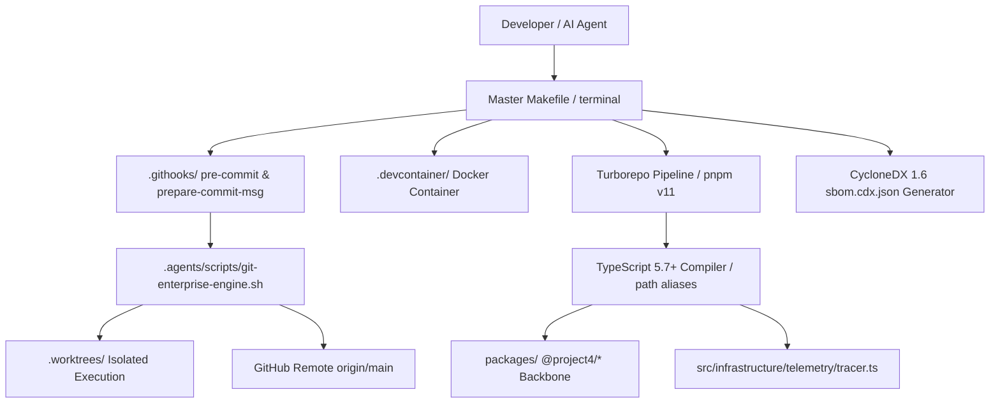

# CODEBASE.md — System Architecture & Directory Map

> Architectural overview and file dependency guide for AI assistants and human developers.

---

## 🗺️ System Topology Diagram



---

## 📁 Project Directory Map

```
/storage/emulated/0/projector/project4/
├── AGENTS.md                  ← Master AI agent rules and standards
├── CODEBASE.md                ← System map & architectural index (this file)
├── STATUS.md                  ← Live interactive workspace status board
├── Makefile                   ← Master CLI automation interface (make help, make check)
├── Dockerfile                 ← Multi-stage production container build
├── docker-compose.yml         ← Container orchestration file
├── tsconfig.json              ← Strict TS 5.7+ compiler flags & path aliases
├── turbo.json                 ← Turborepo build pipeline caching rules
├── sbom.cdx.json              ← CycloneDX 1.6 Supply Chain Security SBOM
├── .editorconfig              ← Code formatting rules across editors
├── .gitignore                 ← Git exclusion rules
├── .env.example               ← Environment variable template
├── .devcontainer/             ← 1-click VS Code / Codespaces dev container
│   └── devcontainer.json
├── .githooks/                 ← Version-controlled native Git hooks
│   ├── pre-commit             ← Secret scanning security gate
│   └── prepare-commit-msg     ← Deterministic auto-commit generator
├── packages/                  ← Monorepo package backbone
│   ├── types/index.ts         ← @project4/types shared interfaces
│   ├── config/index.ts        ← @project4/config app configuration
│   └── utils/index.ts         ← @project4/utils functional helpers
├── src/                       ← Clean Architecture source code
│   └── infrastructure/
│       └── telemetry/
│           └── tracer.ts      ← OpenTelemetry context propagation & logger
├── tests/                     ← Test suites (unit, integration, E2E)
│   └── unit/
│       └── telemetry/
│           └── tracer.test.mjs ← OpenTelemetry tracer test suite
├── docs/                      ← Specifications, architecture plans, & reports
│   └── superpowers/
│       └── plans/             ← Implementation plans (2026-08-13-ultimate-2026-env-upgrade.md)
└── .agents/                   ← AG Kit Governance & Agentic Suite
    ├── ARCHITECTURE.md        ← AG Kit component catalog
    ├── VERSION                ← AG Kit CalVer version (2026.7.27)
    ├── antigravity.json       ← Runtime configuration contract
    ├── agent/                 ← 20 specialist agent personas
    ├── skills/                ← 50+ modular engineering skills
    ├── scripts/               ← Automation scripts (git-enterprise-engine.sh, setup-environment.sh)
    ├── memory/                ← Cross-session persistent memory vault
    │   ├── MEMORY.md          ← Memory index pointer
    │   ├── user-preferences.md← Persistent user settings & style
    │   ├── project-conventions.md ← Coding conventions & branch rules
    │   └── tech-decisions.md  ← Architectural decision record (ADR)
    ├── rules/                 ← Core protocol & routing rules
    └── workflows/             ← Interactive slash command guides
```

---

## ⚙️ Environment Specifications

- **OS / Host**: Ubuntu 26.04 LTS (`resolute`) on `aarch64` inside PRoot-Distro
- **Runtimes**: Node.js `v24.19.0`, Python `3.14.4`
- **VCS**: Git `2.53.0` (Default branch: `main`)
- **Toolkit**: AG Kit `2026.7.27`
- **Build System**: Turborepo + pnpm v11.21

---

## 🔗 File Dependency Matrix

| File / Component | Upstream Dependencies | Downstream Dependents |
| :--- | :--- | :--- |
| `Makefile` | `.githooks/`, `.agents/scripts/` | Developer CLI execution (`make check`, `make sbom`) |
| `tsconfig.json` | `packages/`, `src/` | TypeScript compiler, build tools, path aliases |
| `src/infrastructure/telemetry/tracer.ts` | `node:crypto` | Application observability & correlation logging |
| `packages/` | `tsconfig.json` | Shared domain packages across monorepo (`@project4/*`) |
| `sbom.cdx.json` | `package.json`, `pnpm-lock.yaml` | Supply chain security audit & compliance |
| `.githooks/` | `.agents/scripts/git-auto-commit-msg.sh` | Git commit lifecycle |
| `.devcontainer/` | `Dockerfile`, `docker-compose.yml` | Cloud & container development |
| `AGENTS.md` | `.editorconfig`, `.gitignore` | All agent execution pipelines |

