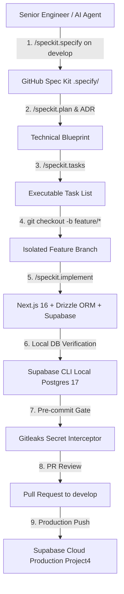

<div align="center">

# ⚡ Project4: Spec-Driven Enterprise Engine

*Government-Grade AI Software Workspace powered by Next.js 16 (proxy.ts), Supabase PostgreSQL 17, Drizzle ORM, TypeScript 7 (Go Compiler), GitHub Spec Kit (SDD), Clean Architecture, and Multi-Agent Governance.*

[](https://github.com/TiMO-ViP/Project4/actions)
[](https://nextjs.org)
[-blue?style=for-the-badge&logo=typescript&logoColor=white)](https://typescriptlang.org)
[](https://supabase.com)
[](https://orm.drizzle.team)
[](https://github.com/github/spec-kit)
[](SECURITY.md)
[](LICENSE)

---

</div>

## 📌 Executive Overview

**Project4** is a government-grade enterprise AI software development environment designed to eliminate prompt drift, security vulnerabilities, and technical debt. Built upon **Clean Architecture**, **NIST SP 800-218 (SSDF)** compliance, and **GitHub Spec-Driven Development (SDD)**, the repository operates from strict, machine-readable contracts that govern technical blueprints, task breakdowns, database migrations, and release lifecycle management.

---

## 🏛️ System Architecture Topology



---

## ✨ Core Pillars & Architecture

| Component | Technology Stack | Enterprise Description |
| :--- | :--- | :--- |
| 🌐 **Fullstack Framework** | **Next.js v16.3.0** (App Router) | React 19, `src/proxy.ts` network boundary (Node.js runtime), Turbopack Rust bundler, and explicit `use cache` directives. |
| 🗄️ **Database & BaaS** | **Supabase CLI v2.113.0** & **PostgreSQL 17** | Local-first Postgres development (`make db-start`), cookie JWT auth (`@supabase/ssr`), and RLS policies (`auth.uid() = user_id`). |
| ⚡ **ORM & Migrations** | **Drizzle ORM v0.45.2** & **Drizzle Kit** | Ultra-lightweight ~50KB SQL-first ORM layer with transparent version-controlled SQL migrations (`supabase/migrations/`). |
| 🔷 **Type Engine** | **TypeScript v7.0.2** | Native Go-ported compiler delivering 8x-12x parallel type-checking speedups with ES2024 NodeNext target. |
| 🏛️ **Clean Architecture** | 4-Tier Domain Separation | Decoupled `src/domain` (Entities & Contracts), `src/application` (Use Cases), `src/infrastructure` (Adapters), and `src/features`. |
| 📜 **Spec-Driven Dev (SDD)**| **GitHub `spec-kit` (`specify-cli`)** | 10 slash commands (`/speckit.specify`, `/speckit.plan`, `/speckit.tasks`, `/speckit.implement`) driving code generation. |
| 🌲 **Git Governance** | `main` ──> `develop` ──> `feature/*` | Protected `main` trunk, primary `develop` integration branch, structured PR workflows, and Conventional Commits. |
| 🔒 **Security & Compliance**| **NIST SP 800-218 (SSDF)** & **Gitleaks** | Zero-trust Server Actions, `.gitleaks.toml` secret scanning, zero secrets in source code, and automated pre-commit interception. |
| 🧠 **2-Tier Memory Engine** | `.agents/memory/` + SQLite FTS5 | **Tier 1**: Markdown vault (`MEMORY.md`). **Tier 2**: Hybrid BM25 vector search engine (`make memory-search`). |

---

## 💻 Developer CLI Command Reference

```bash
# 1. Start local Supabase PostgreSQL 17, Auth, Storage, and Studio GUI
make db-start

# 2. Generate SQL migration files from Drizzle ORM schema changes
npm run db:generate

# 3. Push local database migrations to Supabase Cloud production
make db-push

# 4. Audit live NPM package registry versions
make version-audit

# 5. Run full pre-flight verification audit (lint + format + typecheck + security)
make check

# 6. Search Tier 2 hybrid semantic memory engine
make memory-search Q="supabase auth"
```

---

## 🛠️ Repository Directory Map

```text
/storage/emulated/0/projector/project4
├── .agents/                      # AG Kit Multi-Agent Engine, Skills, & Memory
│   ├── mcp_config.json           # 9 Configured Model Context Protocol Servers
│   ├── memory/                   # Tier 1 Vault & Tier 2 SQLite BM25 Search DB
│   └── skills/                   # 49 Installed Agent Skills (inc. Supabase & Drizzle)
├── .specify/                     # GitHub Spec Kit (SDD Framework)
│   └── memory/constitution.md    # Ratified Project Constitution & SDD Rules
├── docs/                         # Documentation Portal
│   ├── adr/                      # Architecture Decision Records
│   ├── architecture/             # Clean Architecture & Git Strategy Blueprints
│   ├── manifest/                 # Dependency Versions & MCP Server Catalogs
│   └── security/                 # NIST SP 800-218 & FedRAMP Security Guidelines
├── src/                          # Enterprise Clean Architecture Source Code
│   ├── app/                      # Next.js 16 App Router Routes & Layouts
│   ├── domain/                   # Core Business Entities & Contracts (Zero Dependencies)
│   ├── application/              # Application Use Cases & Orchestration Services
│   ├── infrastructure/           # Database (Drizzle ORM) & Supabase Adapters
│   ├── features/                 # Domain Feature Modules
│   └── proxy.ts                  # Next.js 16+ Node.js Runtime Network Boundary
├── supabase/                     # Local Supabase Scaffolding & SQL Migrations
│   ├── config.toml               # Supabase CLI Project Configuration
│   └── migrations/               # Version-Controlled SQL Migration Files
├── tests/                        # Automated Test Suites (unit/, integration/)
├── deploy/                       # Infrastructure as Code & CI/CD Pipelines
├── README.md                     # Master Executive Visual README
├── SECURITY.md                   # Vulnerability Reporting Policy
├── CONTRIBUTING.md               # Developer Contribution & Branching Rules
├── CHANGELOG.md                  # Keep-a-Changelog Version History
├── LICENSE                       # MIT License
├── Makefile                      # Master Single-Word Developer CLI
├── AGENTS.md                     # Universal Machine Directives (Directives 1-6)
└── CODEBASE.md                   # System Map & File Dependency Matrix
```

---

## 📄 Documentation Portal

* 📘 **[AGENTS.md](AGENTS.md)** — Master AI Agent Directives & Guardrails (Directives 1-6)
* 🗺️ **[CODEBASE.md](CODEBASE.md)** — System Architecture Topology & File Dependency Matrix
* 🏛️ **[Clean Architecture Blueprint](docs/architecture/CLEAN_ARCHITECTURE.md)** — Layer Topology & Rules
* 🌲 **[Git Branching Strategy](docs/architecture/GIT_BRANCHING_STRATEGY.md)** — Branch Hierarchy & SDD Lifecycle
* 🔒 **[NIST & FedRAMP Compliance](docs/security/NIST_FEDRAMP_COMPLIANCE.md)** — SSDF Security Controls
* 📊 **[System Versions Manifest](docs/manifest/SYSTEM_VERSIONS.md)** — Audited Tooling & Package Releases
* 🔌 **[MCP Servers Catalog](docs/manifest/MCP_SERVERS_CATALOG.md)** — 9 Configured MCP Servers Matrix
* 🗄️ **[Supabase Stack Guide](docs/manifest/SUPABASE_STACK_GUIDE.md)** — Supabase + Next.js 16 + Drizzle Handbook
* 🛡️ **[SECURITY.md](SECURITY.md)** — Vulnerability Disclosure Policy
* 🤝 **[CONTRIBUTING.md](CONTRIBUTING.md)** — Developer Contribution Guide
* 📜 **[CHANGELOG.md](CHANGELOG.md)** — Milestone Version History
* 📜 **[Project Constitution](.specify/memory/constitution.md)** — Ratified SDD Project Constitution

---

<div align="center">

**[TiMO-ViP/Project4](https://github.com/TiMO-ViP/Project4)** • Built with Next.js 16, Supabase, Drizzle ORM, Spec Kit, & AG Kit • Licensed under MIT

</div>
