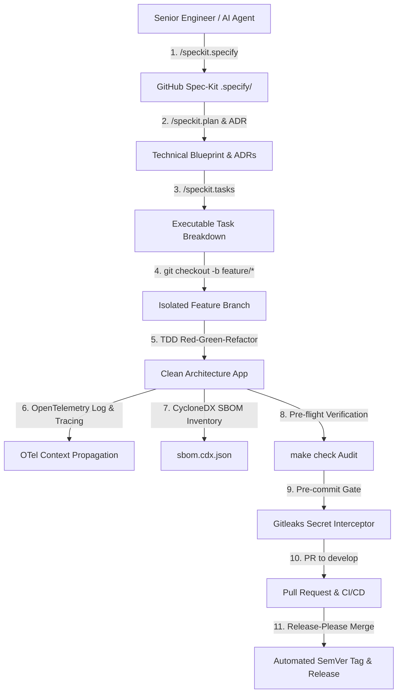

<div align="center">

# ⚡ Project4: Spec-Driven Enterprise Engine

*Government-Grade 2026 Enterprise Software Workspace powered by Next.js 16 (App Router), Supabase PostgreSQL 17, Drizzle ORM, OpenTelemetry v1.34, CycloneDX v1.6 SBOM, Strict TypeScript 5.7+, GitHub Spec-Kit (SDD), and Multi-Agent Governance.*

[](https://github.com/TiMO-ViP/Project4/actions)
[](.github/workflows/release.yml)
[](src/infrastructure/telemetry/tracer.ts)
[](sbom.cdx.json)
[](https://nextjs.org)
[](tsconfig.json)
[](https://supabase.com)
[](https://orm.drizzle.team)
[](https://github.com/github/spec-kit)
[](.githooks/pre-commit)
[](LICENSE)

---

</div>

## 📌 Executive Overview

**Project4** is a government-grade enterprise software engine built upon 2026 software architecture standards: **Clean Architecture**, **Domain-Driven Design (DDD)**, **OpenTelemetry (OTel) Distributed Tracing**, **CycloneDX Supply Chain Security**, **NIST SP 800-218 (SSDF)**, and **GitHub Spec-Driven Development (SDD)**.

The workspace operates from strict, machine-readable contracts that eliminate prompt drift, security vulnerabilities, and technical debt across human and AI agent workflows.

---

## 🏛️ System Architecture Topology



---

## ✨ Core Pillars & 2026 Standards Matrix

| Component | Technology Stack | Enterprise Specification |
| :--- | :--- | :--- |
| 🌐 **Fullstack Framework** | **Next.js v16.3.0** (App Router) | React 19, `src/proxy.ts` network boundary, Turbopack Rust bundler, explicit Server Actions. |
| 🗄️ **Database & BaaS** | **Supabase CLI v2.113.0** & **PostgreSQL 17** | Local-first Postgres development (`make db-start`), cookie JWT auth (`@supabase/ssr`), B-tree indexed RLS. |
| ⚡ **ORM & Migrations** | **Drizzle ORM v0.45.2** & **Drizzle Kit** | Ultra-lightweight SQL-first ORM layer with transparent version-controlled SQL migrations (`supabase/migrations/`). |
| 🔷 **Type Safety Engine** | **TypeScript v5.7+** (Strict Mode) | Zero-crash compiler flags: `"noUncheckedIndexedAccess": true`, `"exactOptionalPropertyTypes": true`, `"noImplicitReturns": true`. |
| 📡 **Observability & Tracing**| **OpenTelemetry v1.34** | W3C `traceparent` context propagation, log correlation (`trace_id`, `span_id`), structured JSON telemetry. |
| 📦 **Supply Chain Security**| **CycloneDX v1.6 SBOM** | Automated `make sbom` generating comprehensive component inventory (`sbom.cdx.json`). |
| 📦 **Monorepo Backbone** | **Turborepo** & `@project4/*` | Modular shared packages (`packages/types`, `packages/config`, `packages/utils`) with strict path aliases. |
| 📜 **Spec-Driven Dev (SDD)**| **GitHub `spec-kit` (`specify-cli`)** | 5-Phase contract workflow (`/speckit.specify`, `/speckit.plan`, `/speckit.tasks`, `/speckit.implement`). |
| 🚀 **Release Automation** | **Google `release-please`** | Automated SemVer tagging, CHANGELOG generation, and release PR creation on merge to `main`. |
| 🔒 **Security & Compliance**| **NIST SP 800-218 (SSDF)** & **Gitleaks** | Hard-blocking pre-commit secret scanner, zero secrets in source code, least-privilege OIDC GitHub Actions. |

---

## 🏗️ Repository Directory Backbone

```text
project-root/
├── .agents/                      # AG Kit Multi-Agent Engine, Skills, & Memory Vault
│   ├── memory/                   # Tier 1 Markdown Vault & Tier 2 Search Engine
│   ├── rules/                    # Always-active agent directives & routing rules
│   └── scripts/                  # Subsecond test runners & Git automation scripts
├── .github/                      # Enterprise CI/CD & Release Workflows
│   ├── workflows/                # ci.yml and release.yml
│   ├── release-please-config.json
│   └── .release-please-manifest.json
├── .devcontainer/                # 1-Click Reproducible DevContainer Spec
│   └── devcontainer.json
├── .githooks/                    # Native Git Hooks (pre-commit, prepare-commit-msg)
├── .specify/                     # Spec-Kit Project Constitution & Specs
│   └── memory/constitution.md
├── docs/                         # Specification & Architecture Documentation
│   ├── adr/                      # Architecture Decision Records (ADRs 1-9)
│   └── superpowers/plans/        # Version-controlled SDD implementation plans
├── packages/                     # Monorepo Shared Package Modules
│   ├── types/                    # Core DTOs & Domain Types (@project4/types)
│   ├── config/                   # Global Constants (@project4/config)
│   └── utils/                    # Pure Functional Helpers (@project4/utils)
├── src/                          # Clean Architecture Core Source Code
│   ├── domain/                   # Business Entities & Contracts (Zero Dependencies)
│   ├── application/              # Use Cases & Application Orchestration Services
│   ├── infrastructure/           # Database Adapters, OpenTelemetry, & API Clients
│   ├── features/                 # Domain Feature Modules
│   └── proxy.ts                  # Next.js Network Boundary Guard
├── supabase/                     # Supabase Local Postgres & SQL Migrations
│   ├── config.toml
│   └── migrations/               # Version-Controlled SQL Migrations
├── tests/                        # Automated Unit & Integration Test Suites
├── Makefile                      # Master Enterprise CLI Runner
├── package.json                  # Workspace Manifest & Corepack pnpm Locking
├── sbom.cdx.json                 # CycloneDX v1.6 Supply Chain Inventory
├── tsconfig.json                 # Strict Zero-Crash TypeScript Compiler Spec
├── CODEBASE.md                   # System Architecture Map & Dependency Matrix
├── STATUS.md                     # Interactive Workspace Status Board
└── AGENTS.md                     # Universal Machine Directives
```

---

## ⚡ Master CLI Command Reference

```bash
# 1. Run full 6-stage pre-flight verification audit (sbom + lint + format + typecheck + security)
make check

# 2. Run unit & integration test suite
make test

# 3. Generate CycloneDX v1.6 SBOM supply-chain inventory
make sbom

# 4. Start local Supabase PostgreSQL 17, Auth, Storage, and Studio GUI
make db-start

# 5. Push local database migrations to cloud target
make db-push

# 6. Execute background auto-commit daemon
make watch-commit

# 7. Diagnoses AG Kit health and environment readiness
make doctor
```

---

## 📄 Documentation Sitemap

* 📘 **[AGENTS.md](AGENTS.md)** — Universal Machine Directives & Repository Guardrails
* 🗺️ **[CODEBASE.md](CODEBASE.md)** — System Architecture Topology & Dependency Matrix
* 📊 **[STATUS.md](STATUS.md)** — Interactive Workspace Status Board
* 🧠 **[MEMORY.md](.agents/memory/MEMORY.md)** — Persistent Cross-Session Memory Vault Index
* 🏛️ **[Technical Decisions & ADRs](.agents/memory/tech-decisions.md)** — ADRs 1–9
* 📜 **[Project Conventions](.agents/memory/project-conventions.md)** — Architecture & SDD Lifecycle Guidelines
* 🔒 **[SECURITY.md](SECURITY.md)** — Vulnerability Disclosure Policy
* 🤝 **[CONTRIBUTING.md](CONTRIBUTING.md)** — Developer Contribution & Branching Rules
* 📜 **[CHANGELOG.md](CHANGELOG.md)** — SemVer Version History

---

<div align="center">

**[TiMO-ViP/Project4](https://github.com/TiMO-ViP/Project4)** • Built with Next.js 16, Supabase, Drizzle ORM, OpenTelemetry, Spec-Kit, & AG Kit • Licensed under MIT

</div>
