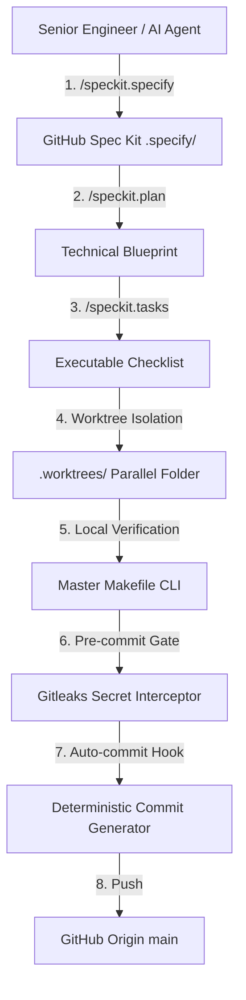

<div align="center">

# ⚡ Project4: Spec-Driven Enterprise Engine

*Autonomous AI Development Workspace with GitHub Spec Kit (SDD), Multi-Agent Governance, Isolated Git Worktrees, 2-Tier Memory Engine, and Single-Word Makefile CLI.*

[](https://github.com/TiMO-ViP/Project4/actions)
[](https://github.com/github/spec-kit)
[](https://github.com/TiMO-ViP/Project4)
[](.githooks/pre-commit)
[](https://nodejs.org)
[](https://python.org)
[](LICENSE)

---

</div>

## 📌 Executive Overview

**Project4** is an enterprise-grade AI software development environment built to eliminate prompt drift, secret leaks, and unmaintainable code. By coupling **GitHub Spec-Driven Development (SDD)** with **AG Kit Multi-Agent Governance**, the repository operates from strict, machine-readable contracts that dictate architectural decisions, task breakdown, and automated git workflows.

---

## 🏛️ System Architecture



---

## ✨ Core Pillars & Capabilities

| Component | Architecture & Technology | Description |
| :--- | :--- | :--- |
| 📜 **Spec-Driven Dev (SDD)** | GitHub `spec-kit` (`specify-cli`) | 10 slash commands (`/speckit.specify`, `/speckit.plan`, `/speckit.tasks`) driving code generation from formal contracts. |
| 🧠 **2-Tier Memory Engine** | `.agents/memory/` + SQLite FTS5 | **Tier 1**: Markdown vault (`MEMORY.md`). **Tier 2**: Hybrid BM25 vector search engine (`make memory-search`). |
| 🌲 **Git Worktree Engine** | `.agents/scripts/git-enterprise-engine.sh` | Spawns isolated, parallel execution folders in `.worktrees/` without switching workspace context. |
| 🔒 **Secret Scanner Interceptor** | Version-Controlled `.githooks/pre-commit` | Blocks unencrypted API tokens, credentials, and private keys before committing. |
| 📝 **Auto-Commit Generator** | `.githooks/prepare-commit-msg` | Deterministic, non-AI script generating 3-part Conventional Commit messages. |
| ⚡ **Master Developer CLI** | Single-Word `Makefile` | Unified CLI interface for linting, testing, formatting, pruning, security, and sync (`make check`, `make sync`). |
| 🐳 **Cloud Container Suite** | `.devcontainer/` + Dockerfile | 1-click cloud development environment for VS Code and GitHub Codespaces. |

---

## 🚀 Quickstart Developer Commands

```bash
# 1. View all single-word developer CLI commands
make help

# 2. Run full pre-flight verification audit (lint + format + typecheck + security)
make check

# 3. Search Tier 2 hybrid semantic memory engine
make memory-search Q="vector memory"

# 4. Safely push current branch to GitHub origin
make sync

# 5. Check GitHub Spec Kit status & integrations
specify check
```

---

## 🛠️ Repository Structure

```text
/storage/emulated/0/projector/project4/
├── .agents/                      # AG Kit Multi-Agent Engine & Memory System
│   ├── memory/                   # Tier 1 Markdown Vault & Tier 2 SQLite DB
│   └── scripts/                  # Worktree engine, commit generator, memory search
├── .specify/                     # GitHub Spec Kit (SDD Framework)
│   ├── memory/constitution.md    # Project Constitution & Non-negotiables
│   └── templates/                # Spec, Plan, Tasks, and Checklist templates
├── .gemini/commands/             # Active Spec Kit Slash Commands (.toml)
├── .githooks/                    # Executable pre-commit & prepare-commit-msg hooks
├── .devcontainer/                # VS Code & Codespaces environment setup
├── Makefile                      # Master single-word developer CLI
├── AGENTS.md                     # Universal machine rules & guardrails
├── CODEBASE.md                   # System map & dependency matrix
└── STATUS.md                     # Live interactive workspace status board
```

---

## 📄 Documentation & Links

* 📘 **[AGENTS.md](AGENTS.md)** — Master AI Agent Directives & Guardrails
* 🗺️ **[CODEBASE.md](CODEBASE.md)** — System Architecture & Dependency Matrix
* 📋 **[STATUS.md](STATUS.md)** — Live Interactive Workspace Status Board
* 📜 **[Project Constitution](.specify/memory/constitution.md)** — Ratified SDD Project Constitution

---

<div align="center">

**[TiMO-ViP/Project4](https://github.com/TiMO-ViP/Project4)** • Built with GitHub Spec Kit & AG Kit • Licensed under MIT

</div>
