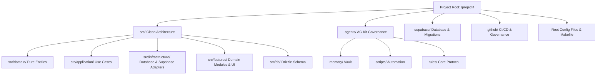

# 📁 Project Directory Topology & Architecture Map

> Architectural index and directory topology guide for human developers and AI assistants.

---

## 🗺️ System Topology Diagram



---

## 📂 Detailed Folder Topology

```
/storage/emulated/0/projector/project4/
├── AGENTS.md                  ← Master AI agent rules and standards
├── CODEBASE.md                ← Architectural map and dependency matrix
├── STATUS.md                  ← Real-time status board
├── README.md                  ← Enterprise project overview & quick start
├── Makefile                   ← Master CLI automation (make check, make test, make auto-commit)
├── Dockerfile                 ← Production container build manifest
├── docker-compose.yml         ← Development container orchestration
├── drizzle.config.ts          ← Drizzle ORM configuration (Local vs Cloud guards)
├── biome.json                 ← High-performance Rust-based linter/formatter config
├── tsconfig.json              ← Strict TypeScript 7 configuration
├── vitest.config.ts           ← Vitest testing suite configuration
├── pyproject.toml             ← Python environment & ruff/pytest config
├── Cargo.toml                 ← Rust 2024 edition Tokio engine config
│
├── .github/                   ← GitHub Enterprise Governance & CI/CD
│   └── workflows/
│       └── ci.yml             ← CI quality gate (secret scanning, Biome, Vitest, tsc)
│
├── .githooks/                 ← Native Git Hooks
│   ├── pre-commit             ← Gitleaks secret scanner & formatting gate
│   └── prepare-commit-msg     ← Deterministic conventional commit generator
│
├── .agents/                   ← AG Kit Governance & Intelligence System
│   ├── ARCHITECTURE.md        ← Component catalog
│   ├── agent/                 ← 20 specialist agent personas
│   ├── skills/                ← 50+ engineering skills
│   ├── scripts/               ← Auto-commit, session logging, memory engines
│   │   ├── auto_commit_on_edit.py
│   │   ├── live_session_logger.py
│   │   └── export-conversation-log.py
│   ├── memory/                ← Cross-session persistent memory vault
│   │   ├── MEMORY.md          ← Memory index pointer
│   │   ├── user-preferences.md← Communication & execution preferences
│   │   └── project-conventions.md ← Clean architecture & branch rules
│   └── logs/                  ← Session logs (live_session.jsonl, CURRENT_SESSION.md)
│
├── src/                       ← Clean Architecture Application Source Code
│   ├── domain/                ← Pure Domain Entities & Interfaces (Zero dependencies)
│   │   └── user/              ← User entity, value objects, and IUserRepository
│   ├── application/           ← Application Use Cases & Orchestration Services
│   │   └── user/              ← CreateUserUseCase, GetUserUseCase
│   ├── infrastructure/        ← External Adapters (Database, Supabase, APIs)
│   │   ├── supabase/          ← Supabase JS client adapter
│   │   └── repositories/      ← Drizzle ORM repository implementations
│   ├── features/              ├── Modular Feature Packages (UI + Local Logic)
│   │   ├── crm/               ├── CRM module
│   │   ├── inventory/         ├── Inventory module
│   │   ├── accounting/        ├── Accounting module
│   │   ├── hr/                ├── HR module
│   │   └── sales/             └── Sales module
│   └── db/                    ← Database Schema & Connection Pool
│       └── schema.ts          ← Drizzle ORM table definitions & B-tree indexes
│
└── supabase/                  ← Supabase Local & Cloud Database Management
    ├── config.toml            ← Supabase CLI & Studio configuration (Port 54323)
    └── migrations/            ← Version-controlled SQL migrations & RLS policies
        └── 20260812000000_create_users_rls.sql
```

---

## 🏛️ Clean Architecture Layer Responsibilities

| Layer | Path | Responsibility | Dependencies |
| :--- | :--- | :--- | :--- |
| **Domain** | `src/domain/` | Business rules, invariants, and repository contracts | **NONE** (Pure TypeScript) |
| **Application** | `src/application/` | Orchestrates domain entities to fulfill use cases | `src/domain/` |
| **Infrastructure** | `src/infrastructure/` | Implements database access, external API clients, Supabase SDK | `src/domain/`, `src/application/` |
| **Features** | `src/features/` | Domain-driven UI components, page routes, and local state | `src/application/`, UI libraries |
